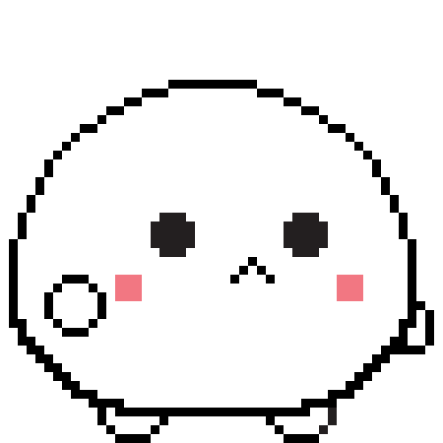

# Step 1 - Drawing a Character Image using UI

## Overview

In this step, to start things off nice and easy. We will simply be:

1. Creating the GFX.Window

2. Drawing our Character Image in the GFX.Window

3. Scheduling our wire on the mesh and running it.

## Step 1.1: Downloading our image

Before we can draw our character image on screen, we will first need, a character image! Any character image will do, but if you don't have one, say hello to Glod! (Dowload Glod Image). Create a folder in the same location as your script called "GlodImages" and add your image there. Make sure that your image is named "Character1.png"



Now, with our character image ready, we can start!

## Step 1.2: Initialising our variables

Now, we will create an image variable and tell our programme where to locate the image that we will be using. We will wrap this line of code in a defshardsshard. This shard will be called at the start of our code, where we will be innitializing all our variables.

??? "What is Initialising?"
    Innitialising is a good habit where you create all the variables that will be required in your programme at the start of your code. This helps to keep your code organized and neat.

=== "Initialise Code"

    ```clojure linenums="1"
    (defshards initialize-character []
        (LoadImage "GlodImages/Character1.png") = .character-image)
    ```

## Step 1.3: Creating the main loop-wire

Following that, we will create the main loop-wire which will be scheduled on the mesh. The `Innitialize_Character` shard that we have just created will be called at the start of this loop-wire wrapped in a Setup shard.

??? "What is Initialising?"
    The Setup shard ensures that every line of code called within it will only happen once,  Thus by placing the Innitiallize_Character shard within a Setup shard, we ensure that it is only called once despite being placed in a defloop. We want to innitialise variables once as we do not need to have our programme to continuously create a new instance of the same variable continuously. We only need one instance of all our variables which we will be reusing.

=== "Main Loop Wire"

    ```{.clojure .annotate linenums="1"}
    (defshards initialize-character []
        (LoadImage "GlodImages/Character1.png") = .character-image) ;; (1)

    (defloop main-wire
    (Setup
    (innitialize-character))
    )

    (defmesh main)
    (schedule main main-wire)
    (run main (/ 1.0 60))
    ```

    1. **.character-image** is the variable that contains our image

## Step 1.4: Creating the Window

Trying to run our program right now would result in ... nothing. This is because all we are doing is just initializing the variable .Character-Image.  To draw our image on screen however, we will have to create the window to draw our image on.

=== "Initialise Code"

    ```clojure linenums="1"
    (defshards initialize-character []
        (LoadImage "GlodImages/Character1.png") = .character-image)

    (defloop main-wire
    (Setup
    (initialize-character))
    
    (GFX.MainWindow
    :Title "MainWindow" :Width 1920 :Height 1080
    :Contents
    (-> (Setup
                    (GFX.DrawQueue) >= .ui-draw-queue
                    (GFX.UIPass .ui-draw-queue) >> .render-steps)
                    .ui-draw-queue (GFX.ClearQueue)
                    
                    (UI
                    .ui-draw-queue)
                    
                    (GFX.Render :Steps .render-steps)
                    
                    )))
    

    (defmesh main)
    (schedule main main-wire)
    (run main (/ 1.0 60))
    ```

Try running the program now. Something happens! The window you see is the window that you have just created using the code above. Changing the width and height in the :Width and `:Height` tags will change the size of this window accordingly. 

## Step 1.5: Drawing the Image on the Screen

We are almost there, the last step is to draw the image on screen. To do this, we use the `UI.Area`, the `UI.Image` and `GFX.Texture` shard.
First, we create a LoadTexture shard to load our images as textures. This would make it easier for our computer to load images and ensures that our programme runs smoothly even if we use large images.

=== "Code Added"
    
    ```{.clojure .annotate linenums="1"}
    (defshards LoadTexture [name] ;; (1)
        (LoadImage name)
        (GFX.Texture))
    ```

    1. The **LoadTexture** shard will allow our images to be loaded as textures.

    ```{.clojure .annotate linenums="1"}
    (UI.Area :Position (float2 0 0) ;; (1)
                  :Anchor Anchor.Center
                  :Contents
                  (->
                  LoadTexture .character-image (UI.Image :Scale (float2 0.2))))
    ```

    1.  **UI.Area** allows our image to be drawn on screen in the specified area.

=== "Full Code So Far"
    
    ```{.clojure .annotate linenums="1"}
    (defshards LoadTexture [name]
    (LoadImage name)
    (GFX.Texture))

    (defshards initialize-character []
    (LoadTexture "GlodImages/Character1.png") = .character-image)

    (defloop main-wire
    (Setup
    (initialize-character))
    
    (GFX.MainWindow
    :Title "MainWindow" :Width 1920 :Height 1080
    :Contents
    (-> (Setup
                    (GFX.DrawQueue) >= .ui-draw-queue
                    (GFX.UIPass .ui-draw-queue) >> .render-steps)
                    .ui-draw-queue (GFX.ClearQueue)
                    
                    (UI
                    .ui-draw-queue
                    (->
                    (UI.Area :Position (float2 0 0)
                                :Anchor Anchor.Center
                                :Contents
                                (->
                                LoadTexture .character-image (UI.Image :Scale (float2 0.2))))))
                    
                    (GFX.Render :Steps .render-steps)
                    
                    )))
    

    (defmesh main)
    (schedule main main-wire)
    (run main (/ 1.0 60))
    ```

??? "[name]"
    Adding `[name]` when creating a shard allows that shard to be taken as an input variable. Here `[name]` will be used as the variable for **LoadImage**.

Try running the program now. You should see adorable little Glod in the center of your screen. Congratulations! You have successfully drawn an image on the screen.


## Recap

In this step we have successfully drawn an image on screen by innitializing our image variable, creating a Window, and lastly, by using the UI.Area and UI.Image Shards to draw our image within the window.
We would be very hard pressed however to make a game out of a single static unchanging image. Hence in the next step, we will learn how to dynamically change adorable Glod's image by pressing buttons.
God job so far and see you in the next step! 👋