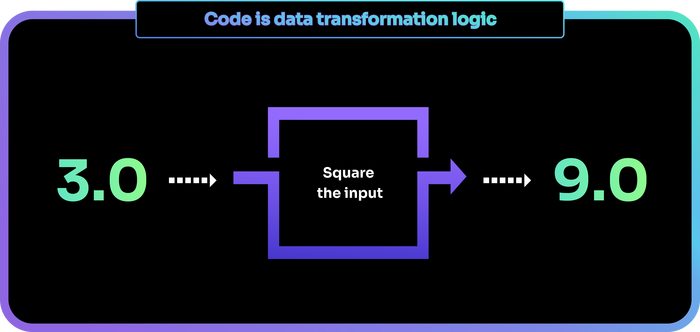

# Introduction

In this section, we talk about code and programming from the ground up.

## What is code?

Put simply, computer code is a set of instructions to a computer on how to transform data.

In other words, code is the transformation logic that the computer uses to transform its input into output.

Figure 1

For example, an instruction telling the computer to calculate the square of a number is code.

Figure 2

Also, these data transformation logic blocks can be applied one after the other in a sequence. A sequence like this is also code.

Figure 3

A programming language is a human-readable syntax for writing out such instructions. A set of such instructions (or sequence of instructions) is considered a program or a source code.

??? note "Tech Tip"
    This source code is further parsed (processed and coverted) into a form that the computer understands (i.e. steps in building the source code like compiling, linking, etc.) but a discussion about that is beyond the scope of this text.

## What is Shards?

On the surface Shards is just like other programming languages:

  1. You write your code using Shards' syntax
  2. You submit this code to the computer
  3. The computer parses this code and manipulates the data as instructed, giving an output

!!! note
    Shards syntax is highly visual hence development in Shards feels very similar to [Visual programming](https://en.wikipedia.org/wiki/Visual_programming_language), but without giving up the power and expressiveness of textual syntax.

However, unlike other languages, Shards code syntax has two layers to it and hence consequently the parsing of a Shards program also involves two phases.

This dual nature of Shards gives it power and flexibility unmatched by traditional programming languages.

In the next few sections we dive deep into these concepts.

--8<-- "includes/license.md"
