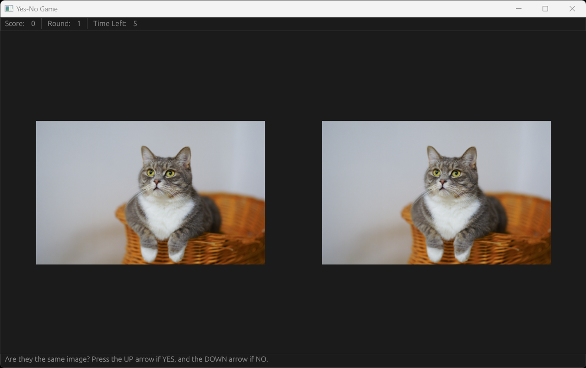

# Step 3

In this chapter, we will be implementing logic that lets your program ready itself for a game round!

## Initializing each Round

Create a shard named `initialize-round`. We will be adding code to prepare each round here.

=== "Code"
    
    ```clojure linenums="1"
    (defshards initialize-round [])
    ```

Place the new shard into the `logic-loop`. Wrap it within a `Setup` shard to ensure it only runs once (for now). We will add conditionals later that ensures `initialize-round` is only called when a new round should begin.

!!! note
    Without placing `initialize-round` in `Setup`, it will be called constantly with each loop iteration. We do not want this! `initialize-round` should only be called at the start of each round.

=== "Code"

    ```clojure linenums="1"
    (defloop logic-loop
      (Setup (initialize-round)))
    ```

## Selecting the Images

We will use the `RandomInt` shard to randomly select an index from our `.image` sequence. The image stored at that index will be displayed in the game.

Navigate to `initialize-variables`. 

Define the following variables to hold the randomly selected indices:

-  `.left-image-index`

-  `.right-image-index`

=== "Code"

    ```{.clojure .annotate linenums="1"}
    (defshards initialize-variables []
      0 >= .left-image-index ;; (1)
      0 >= .right-image-index ;; (2)

      0 >= .total-score
      1 >= .current-round
      max-timer >= .time-remaining)
    ```

    1. The randomly selected index to use for the left image.
    2. The randomly selected index to use for the right image.


`RandomInt` requires the user to pass in the maximum number it can select up to. For example, `(RandomInt :Max 2)` will randomly choose a number from 0 to 1.

Count the number of images in the `.images` sequence and store the value in a variable named `.total-images`. This value will be passed in as the `:Max` for `RandomInt`.

=== "Code"

    ```{.clojure .annotate linenums="1"}
    (defshards initialize-variables []
      0 >= .left-image-index
      0 >= .right-image-index
      (Count .images) >= .total-images ;; (1)
      
      0 >= .total-score
      1 >= .current-round
      max-timer >= .time-remaining)
    ```

    1. [`Count`](https://docs.fragcolor.xyz/docs/shards/General/Count/) will count the number of elements in a sequence. It can also count the number of characters in a string, or key-value pairs in a table.

With `.total-images` as the upper limit for our random index range, we can now use `RandomInt` to determine our image indices. As the images chosen will change each round, we will select the images in the `initialize-round` shard.

=== "Code"

    ```{.clojure .annotate linenums="1"}
    (defshards initialize-round []
      (RandomInt :Max .total-images) > .left-image-index ;; (1)(2)
      (RandomInt :Max .total-images) > .right-image-index)
       
    ```

    1. Randomly selects an index in the .image sequence.
    2. [`RandomInt`](https://docs.fragcolor.xyz/docs/shards/General/RandomInt/) will randomly output a number from 0 to the number before the maximum value specified.

Previously we used a placeholder to always show the first two images stored in `.images`. With the new logic implemented, we can update our UI code to display randomly selected images instead.

Navigate to `UI.CentralPanel` in the `main-game-ui` shard.

Replace:
=== "Code"

    ```{.clojure .annotate linenums="1"}
    .images (Take 0) (UI.Image)
    .images (Take 1) (UI.Image)
    ```

With:
=== "Code"

    ```{.clojure .annotate linenums="1"}
    .images (Take .left-image-index) (UI.Image) ;; (1)
    .images (Take .right-image-index) (UI.Image)
    ```

    1. Retrieve the chosen image from the sequence
    
    
## Outcome

Congratulations! Your game can now display random images at the start of each round. 

Try running the code to see how the images change every time the game is run.

In the next chapter, we will be adding multiple rounds to your game to increase its playability.

=== "Full Code"

    ```{.clojure .annotate linenums="1"}
    (def total-rounds 10)
    (def max-timer 5)

    (defshards load-resources []
      (LoadImage "data/cats/cat01.png") (Push :Name .images)
      (LoadImage "data/cats/cat02.png") (Push :Name .images)
      (LoadImage "data/cats/cat03.png") (Push :Name .images))

    (defshards initialize-variables []
      0 >= .left-image-index
      0 >= .right-image-index
      (Count .images) >= .total-images

      0 >= .total-score
      1 >= .current-round
      max-timer >= .time-remaining)

    (defshards initialize-round []
      .total-images
      (RandomInt :Max .total-images) > .left-image-index (Log)
      (RandomInt :Max .total-images) > .right-image-index (Log))

    (defshards main-game-ui []
      (UI.BottomPanel
       :Contents (-> "Are they the same image? Press the UP arrow if YES, and the DOWN arrow if NO." (UI.Label)))

      (UI.TopPanel
       :Contents
       (->
        (UI.Horizontal
         :Contents
         (->
          "Score: " (UI.Label)
          .total-score (ToString) (UI.Label)
          (UI.Separator)
          "Round: " (UI.Label)
          .current-round (ToString) (UI.Label)
          (UI.Separator)
          "Time Left: " (UI.Label)
          .time-remaining (ToString) (UI.Label)))))
  
      (UI.CentralPanel
       :Contents
       (->
        (UI.Horizontal
         :Contents
         (->
          (UI.Area
           :Position (float2 -250.0, 0.0)
           :Anchor Anchor.Center
           :Contents
           (-> .images (Take .left-image-index) (UI.Image)))
          (UI.Area
           :Position (float2 250.0, 0.0)
           :Anchor Anchor.Center
           :Contents
           (-> .images (Take .right-image-index) (UI.Image))))))))

    (defloop ui-loop
      (GFX.MainWindow
       :Title "Yes-No Game"
       :Width 1280 :Height 768
       :Contents
       (->
        (Setup
         (GFX.DrawQueue) >= .ui-draw-queue
         (GFX.UIPass .ui-draw-queue) >> .render-steps)
        (| .ui-draw-queue (GFX.ClearQueue))
        (UI .ui-draw-queue (main-game-ui))
        (GFX.Render :Steps .render-steps))))

    (defloop logic-loop
      (Setup (initialize-round)))

    (defloop game-loop
      (Setup (load-resources) (initialize-variables))
      (Branch [ui-loop, logic-loop]))

    (defmesh main)
    (schedule main game-loop)
    (run main (/ 1.0 60.0))
    ```

=== "Result"

        
    


--8<-- "includes/license.md"
